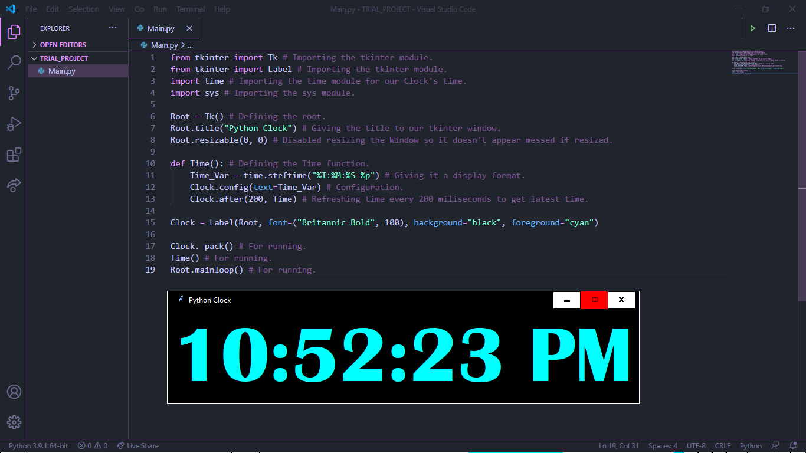

# Python_Clock
This Project focuses on How to Program a Digital Clock using Python. I have used modules such as time, sys, and tkinter. Also note that you don't need to install these modules as they come built-in if you have installed Python correctly. This is a basic Project and below is my Project Screenshot:

Hope that you liked it.
